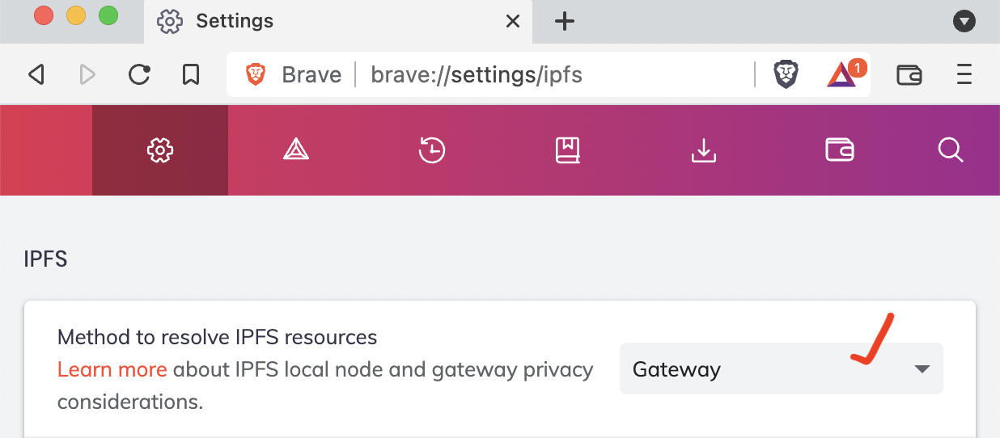

# `truffle preserve` Example box

This box provides a starting point for trying out the new `truffle preserve`
command. See [screen recording](https://youtu.be/Wcwl2Vq32HY).

## How to try this out

1. Uninstall any old version of Truffle you might have and install v5.1:
   ```
   $ npm uninstall -g truffle
   $ npm install -g truffle@preserves
   ```

2. Make sure you're in an empty directory and unbox this project:
   ```
   $ truffle unbox preserve-example
   ```

3. Preserve your data! This box comes configured for the infura environment in
   `truffle-config.json`
   ```
   truffle preserve ./app --ipfs --environment infura
   ```
   <details><summary>Preserve output</summary>

   ```
   Preserving target: ./app
   ========================

     ✓ Loading target...
       ✓ Reading directory ./app...
         ✓ Opening ./app/index.html...
         ✓ Opening ./app/under-construction.gif...

     ✓ Preserving to IPFS...
       ✓ Connected to IPFS node at https://ipfs.infura.io:5001
       ✓ Uploading...
         Root CID: QmSG97QfdMCn3kbyu1EeeZekLtY94hogPj5NVWnpab33zx
           ./index.html: QmNMJEUvYkXh7fPVZVYrMW26HSMfpBWJQeqZBypAYCic3s
           ./under-construction.gif: QmYjrRNSa9Y8JBNLprAAZrDkMq5rvf9NoKPVouBSNq1Dic
   ```

   </details>

4. Use the Root CID from the preserve command output to verify your data is
   retrievable. Using the brave browser you can navigate to
   `ipfs://QmSG97QfdMCn3kbyu1EeeZekLtY94hogPj5NVWnpab33zx`
   

## Notes on verifying on Brave browser 

The [Brave browser](https://brave.com/) has build-in support for IPFS! You'll
need to configure it use `Gateway` as the method to resolve IPFS resources. 

<details><summary>Show screenshot</summary>



</details>
